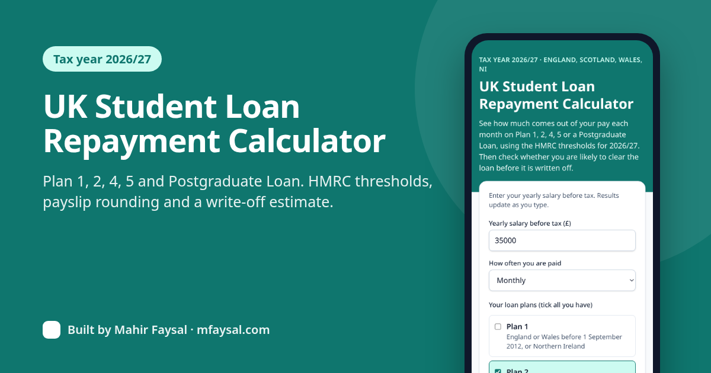
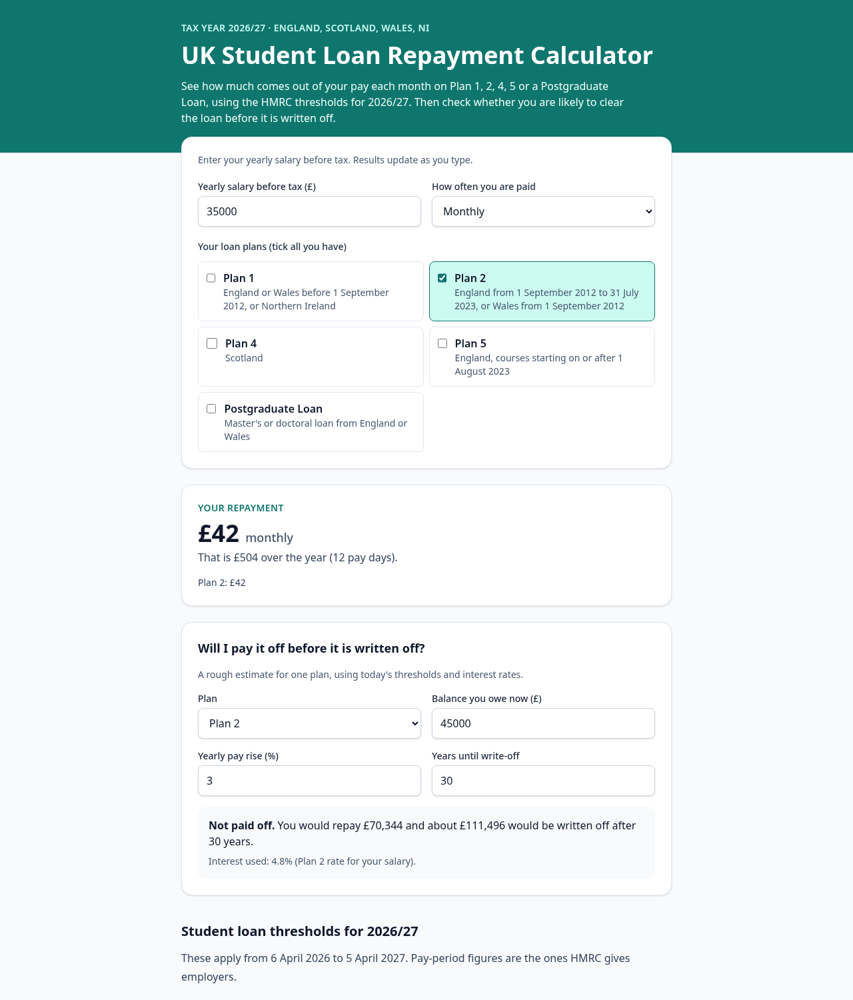
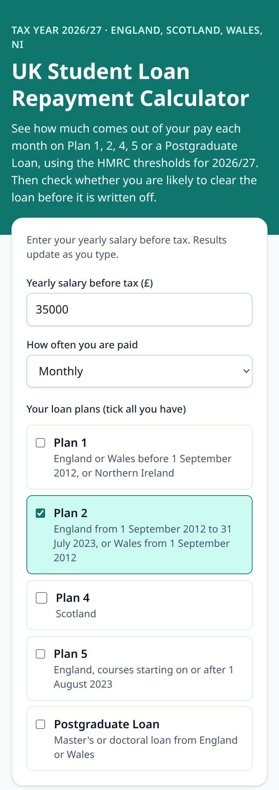

# UK Student Loan Repayment Calculator (2026/27)

Work out how much of your pay goes on your UK student loan each pay day, on **Plan 1, Plan 2, Plan 4, Plan 5** or a **Postgraduate Loan**, using the HMRC thresholds for the 2026/27 tax year. It also estimates whether you will clear the loan before it is written off.

**Live:** https://uk-student-loan-repayment-calculator.vercel.app



## Features

- Monthly, weekly, fortnightly, four-weekly or yearly pay.
- Payroll-accurate: pay-period thresholds cut to the penny like HMRC's employer tables, 9% (or 6%) over the threshold, rounded **down** to the whole pound.
- Several plans at once: one 9% deduction over the lowest undergraduate threshold, split between plans the way gov.uk describes, plus 6% for a Postgraduate Loan.
- Payoff / write-off estimate with yearly pay rises, and Plan 2's income-based interest (4.1% rising to 6%).
- Runs entirely in the browser. No accounts, no tracking, no API keys.

| Desktop | Mobile |
| --- | --- |
|  |  |

## 2026/27 rules used

| Plan | Yearly threshold | Rate | Written off after |
| --- | --- | --- | --- |
| Plan 1 | £26,900 | 9% | 25 years |
| Plan 2 | £29,385 | 9% | 30 years |
| Plan 4 | £33,795 | 9% | 30 years |
| Plan 5 | £25,000 | 9% | 40 years |
| Postgraduate Loan | £21,000 | 6% | 30 years |

Sources (checked 4 October 2026): [how much you repay](https://www.gov.uk/repaying-your-student-loan/what-you-pay), [HMRC rates and thresholds for employers 2026 to 2027](https://www.gov.uk/guidance/rates-and-thresholds-for-employers-2026-to-2027), [when loans are written off](https://www.gov.uk/repaying-your-student-loan/when-your-student-loan-gets-written-off-or-cancelled). All figures live in [`src/lib/loans.ts`](src/lib/loans.ts).

> This is an independent estimate, not advice, and is not connected to the Student Loans Company or HMRC.

## Stack

Next.js 16 (App Router, static) · TypeScript · Tailwind CSS v4 · Vitest

## Develop

```bash
npm install
npm run dev     # http://localhost:3000
npm test        # unit tests, including every worked example on gov.uk
npm run lint
npm run build
```

## Author

Built by [Mahir Faysal](https://mfaysal.com), a student web developer.

- Project page: [UK Student Loan Calculator on mfaysal.com](https://mfaysal.com/projects/uk-student-loan-calculator)
- More projects: [mfaysal.com/projects](https://mfaysal.com/projects) · Blog: [mfaysal.com/blog](https://mfaysal.com/blog)
